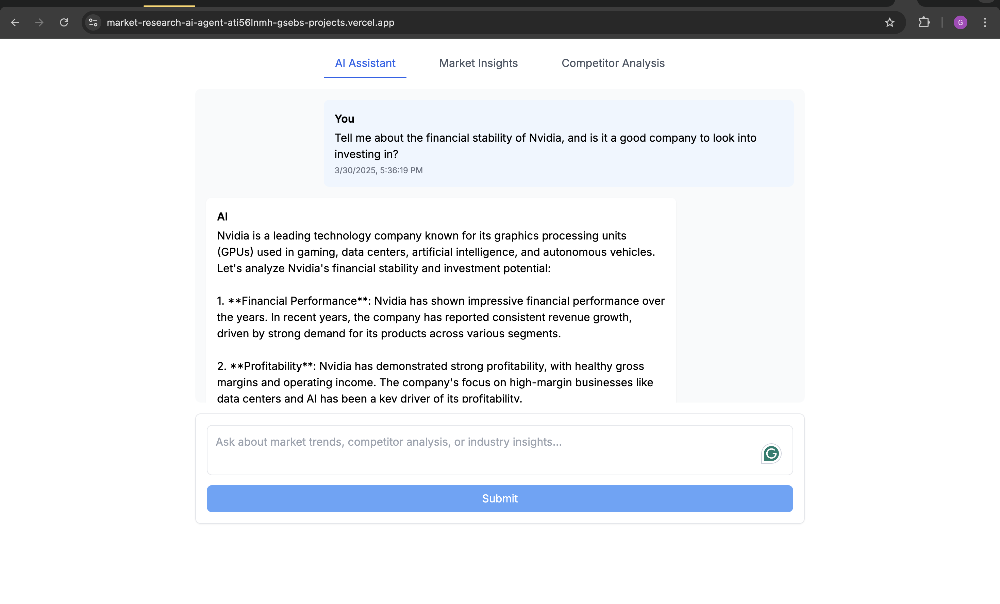
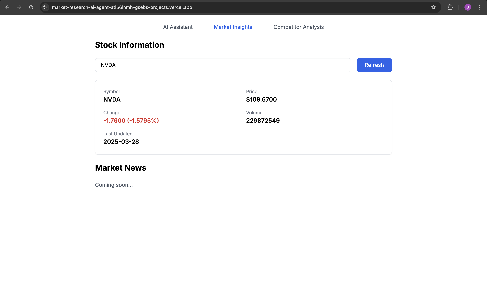
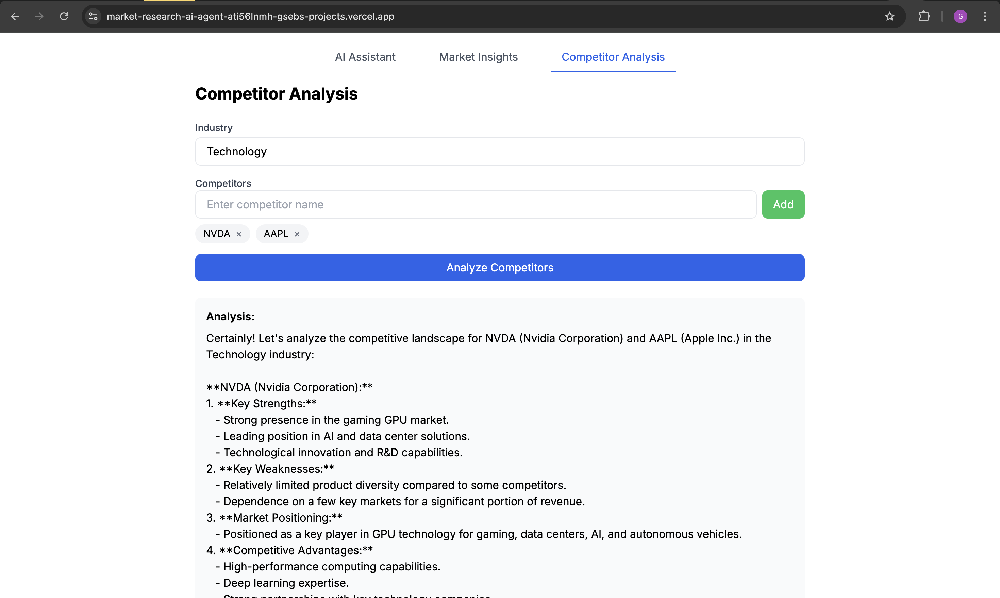

# AI Market Research Agent

<div align="center">
  <h2>
    <a href="https://market-research-ai-agent-ati56lnmh-gsebs-projects.vercel.app/">
      Try the Live Application
    </a>
  </h2>
  <p><i>Experience AI-powered market research and competitor analysis in real-time!</i></p>
  <br/>
</div>

A market research assistant powered by AI that helps analyze competitors, market trends, and provides valuable insights for business decision-making.

##  Application Overview

### Main Interface

*The main interface of our AI Market Research Agent, featuring an intuitive chat interface for natural interactions with the AI.*

### Market Analysis

*Real-time market analysis and insights, powered by Alpha Vantage API and OpenAI.*

### Competitor Analysis

*Detailed competitor analysis with strengths, weaknesses, and market positioning.*

## Features

- **Real-time Market Data Analysis**: Fetch and analyze current market data using Alpha Vantage API
- **Competitor Analysis**: Deep dive into competitor strengths, weaknesses, and market positioning
- **Market Trends**: AI-powered analysis of current market trends and future predictions
- **Interactive Chat Interface**: Natural language interaction with the AI agent
- **Beautiful UI**: Modern, responsive design with Tailwind CSS

##  Architecture

The application is built with a modern tech stack:

```
├── Frontend (Next.js + React)
│   ├── Chat Interface
│   ├── Market Insights Dashboard
│   └── Competitor Analysis View
│
├── AI Engine (LangChain + OpenAI)
│   ├── Market Analyst Agent
│   ├── Competitor Analysis
│   └── Trend Prediction
│
└── Data Sources
    ├── Alpha Vantage API
    └── OpenAI GPT Models
```

## Technical Stack

- **Frontend**:
  - Next.js 14
  - React
  - Tailwind CSS
  - TypeScript

- **Backend**:
  - Next.js API Routes
  - LangChain
  - OpenAI GPT Models
  - Alpha Vantage API

- **DevOps**:
  - Vercel (Deployment)
  - GitHub (Version Control)
  - Environment Variable Management
  - Docker Support

## Getting Started

1. Clone the repository:
```bash
git clone https://github.com/Gsebs/AI-Market-Research-Agent.git
cd AI-Market-Research-Agent
```

2. Install dependencies:
```bash
npm install
```

3. Set up environment variables:
Create a `.env.local` file with:
```
OPENAI_API_KEY=your_key_here
ALPHA_VANTAGE_API_KEY=your_key_here
USE_GPT4=false
```

4. Run the development server:
```bash
npm run dev
```

5. Open [http://localhost:3000](http://localhost:3000) in your browser.

## Project Structure

```
├── app/                  # Next.js app directory
│   ├── api/             # API routes
│   ├── layout.tsx       # Root layout
│   └── page.tsx         # Home page
├── agents/              # AI agent implementations
├── components/          # React components
├── lib/                 # Utility functions and configurations
└── public/             # Static assets
```

## AI Implementation

The project uses LangChain to orchestrate AI interactions:

1. **Market Analyst Agent**:
   - Processes natural language queries
   - Analyzes market trends
   - Provides competitor insights

2. **Data Processing**:
   - Real-time market data integration
   - Sentiment analysis
   - Trend prediction

3. **Response Generation**:
   - Structured analysis
   - Data-driven recommendations
   - Clear explanations

## Security Features

- Secure environment variable handling
- API key protection
- Rate limiting
- Error handling

## UI/UX Features

- Responsive design
- Real-time updates
- Interactive chat interface
- Data visualizations
- Loading states
- Error handling

## Market Data Integration

The application integrates with Alpha Vantage API to provide:
- Real-time stock quotes
- Company information
- Market news
- Technical indicators


## License

This project is licensed under the MIT License - see the [LICENSE](LICENSE) file for details.

## Acknowledgments

- OpenAI for GPT models
- Alpha Vantage for market data
- Vercel for hosting
- Next.js for framework 
